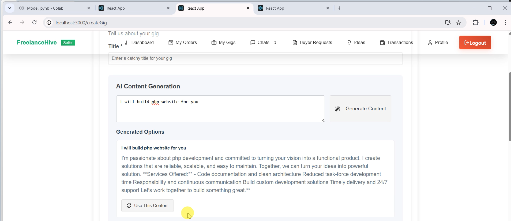
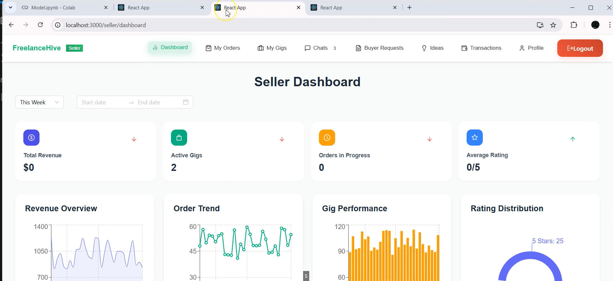
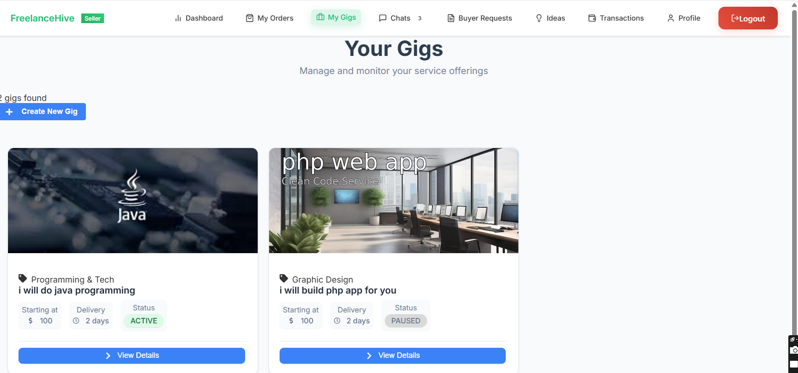
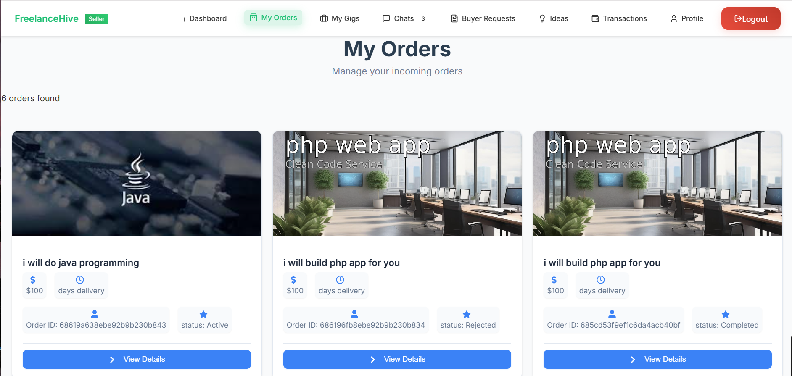
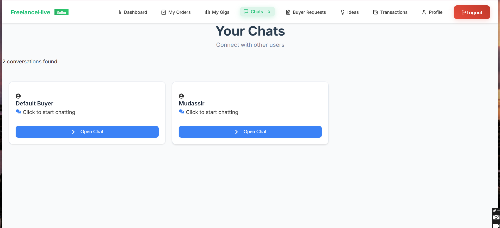
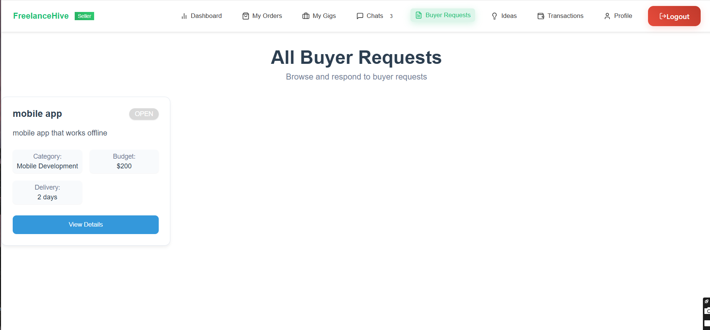

# FreelanceHive

## Overview
FreelanceHive is a comprehensive full-stack platform connecting buyers and sellers of freelance services. It supports gig creation, order processing, payments, user authentication, real-time chat and meetings, AI-powered tools, analytics, and buyer requests. The platform is composed of a React web frontend, a React Native mobile app, and a Node.js backend API.

It integrates advanced AI models for both text generation and image creation, enhancing user interactions and content generation.

## AI Integration
- **GPT-2**: Used for natural language generation such as chat assistance and smart suggestions.
- **Stable Diffusion XL Base 1.0 (by Stability AI)**: Used for generating high-quality images from text prompts.

## Project Structure
- **Backend**: Node.js (Express), MongoDB, real-time communication via Socket.IO
- **Mobile App**: React Native (iOS and Android) with Expo
- **Web Frontend**: React with modern UI and UX libraries

## Dependencies
### Backend
- bcrypt
- jsonwebtoken
- mongoose
- multer
- socket.io
- stripe
- nodemailer
- natural
- compromise
- pdfkit
- cors
- nodemon
- google-auth-library
- express

### Mobile App
- React Native core libraries
- Navigation: @react-navigation/*
- File and Media Handling: expo-file-system, expo-document-picker, react-native-image-picker, expo-av
- Communication: react-native-webrtc, socket.io-client
- UI and Utilities: react-native-gesture-handler, @expo/vector-icons, react-native-safe-area-context

### Web Frontend
- UI: antd, @mui/material, bootstrap, tailwindcss, lucide-react, @heroicons/react
- Charts and Analytics: chart.js, @ant-design/plots, recharts, @tremor/react
- Forms and Input: react-quill, react-signature-canvas, react-icons, @react-oauth/google
- Documents and PDFs: jspdf, pdf-lib
- Motion and Animations: framer-motion, react-reveal
- HTTP and Routing: axios, react-router-dom
- Utilities: date-fns, dompurify, web-vitals

## Core Modules and Features
### 1. Gig Management
- Seller: Create, edit, pause, delete gigs; view details; rank gigs
- Buyer: Browse trending gigs, filter and search, view detailed gig info
- Admin: Review, approve, or reject gigs

### 2. Order Management
- Buyers place and manage orders; sellers can send, accept, or decline custom offers
- Sellers can dispute, cancel, or modify orders
- Collaborative task sharing among sellers
- Real-time status updates and notifications
- Admin control over all orders

### 3. Payment System
- Wallet linking, deposits, withdrawals
- Transaction history for buyers and sellers
- Admin moderation of payments, releases, and refunds

### 4. User Management
- Account creation, login, profile management
- Document verification and admin approval workflows
- Role-based access for Admins

### 5. Chat and Meetings
- Real-time text, voice, and video communication
- Secure file sharing within chat
- Admin access to monitor messages

### 6. Idea Pitching and Equity Collaboration
- Buyers can pitch project ideas and request co-ownership
- Sellers can review, accept, and collaborate on pitches
- Ownership details tracked and stored securely

### 7. Reports and Analytics
- Gig, user, order, and payment analytics dashboards
- Role-specific insights for Admin, Seller, and Buyer

### 8. Buyer Requests
- Buyers can submit and manage requests
- Sellers can browse, filter, and propose offers
- Admin review and moderation tools

## Screenshots








## Running the Project

### Backend
```
cd Backend
npm install
npm start
```

### Mobile App (Requires Expo)
```
cd MobileApp
npm install
npm start
```

### Web Frontend
```
cd WebFrontend/frontend
npm install
npm start
```
